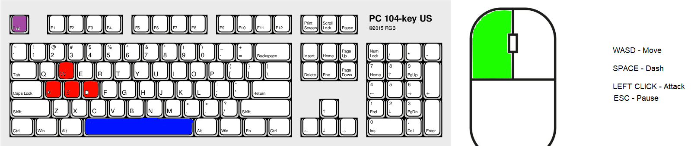

# 7382-Team-C-2020
Team Juan Camilo Garcia Cuevas, Lazzaro Boivin and Mathias Glorieux

----------------------------USER MANUAL-------------------------------

                                                             HOW TO PLAY

You are Ziae'l, your job is to fight the entities that are challinging the balance of the world. For this demo you will have 2 fights.

1st Fight: This is a tutorial, the boss will attack you with a line attack, shooting fast projectles toward you. This boss can also conjure a cirlce of fire beneath you, dash away from it (SPACE to dash). Reach the end of the bridge and attack (LEFT CLICK) the enemy.

2nd Fight: Chaos runs rampant in the world, stop this beast! This boss will attack you with a line attack and circle of fire in a similar way from the 1st boss, but watch out, this one can call upon a shower of meteors to crush you. The ground is HOT! Certain ground is dangerous and will harm you, these fire tiles can be temporarily disabled by standing on all 6 Holy Areas. THIS BOSS IS IMMUNE! In order to damage the boss you must stand on the Holy Areas, this will weaken the boss temporarily and allow you to deal damage.

                                                              CONTROLS

.jpg)

                                                              SOURCES
                                                              
Music : (to be replaced for not copyrighted music)
Main menu - Oceiros The Consumed King by Yuka Kitamura (DARK SOULS III)

Win Screen - https://www.youtube.com/watch?v=_uNNRs19EzQ - ending from evangelion

Loss Screen - Secret Betreyal by Yuka Kitamura (DARK SOULS III)

Bridge Boss - Nameless King by  Yuka Kitamura (DARK SOULS III)

Chaos Boss - Slave Knight Gael  Yuka Kitamura (DARK SOULS III)

Art:
Player - https://opengameart.org/content/fumiko-complete-charset

Boss - https://opengameart.org/content/gaia-free-boss-monster

Tiles - https://assetstore.unity.com/packages/3d/environments/2d-pixelart-isometric-blocks-115039 (disabled fire tile edited by me)

FireBall - https://opengameart.org/content/fireballs

Meteor - https://opengameart.org/content/meteor-animated-64x64

AOE explosion - https://opengameart.org/content/explosion-animations

